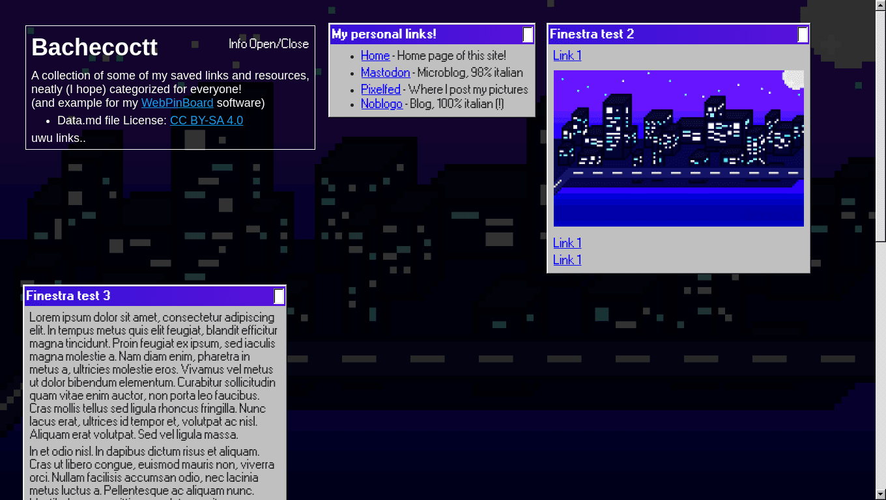

# WebPinBoard

WebPinBoard is a Personal Static HTML Pinboard for Links and Images.  
It works like this:
- You write all the links to webpages and images you want to organize in a [Markdown file](Source/Data.md)
- You run (or the server automatically does so for you, like on GitLab) the Generate.py program
- You get a fully static HTML page containing your translated markdown, organized into boards, or small windows

Right now, it requires no JavaScript, just some CSS for displaying everything on screen correctly.  
(TODO: Make sure the generated page is at least readable on browsers without CSS3 support).

## Live demo

Live demo (which is also my personal board) is hosted in this repo and available on my website!  
[octospacc.gitlab.io/WebPinBoard](https://octospacc.gitlab.io/WebPinBoard/)

## Writing

The Markdown data file has a simple structure:
- Headings denote a new board, and all the content that follows will go under that board
- You can put flags to indicate special properties at the end of an heading line:
  - `:Closed` makes the board appear collapsed by default
- Every board full name can only be used once (otherwise CSS will break)
- The first ever board in the file is special (it will be the Info board, with a different design)

Check my personal file for visual examples.

## License

The Generate.py program, the HTML codes in it embedded, and my CSS codes, are licensed under the AGPL-3.0 license. Check the [LICENSE.md file](LICENSE.md) for more details.

The [Data.md](Source/Data.md) file serves both as an example and as my real private usage of this program.  
Since it's not code, but rather a document basically listing names and links, I licensed it under the [CC BY-SA 4.0 license](https://creativecommons.org/licenses/by-sa/4.0).
